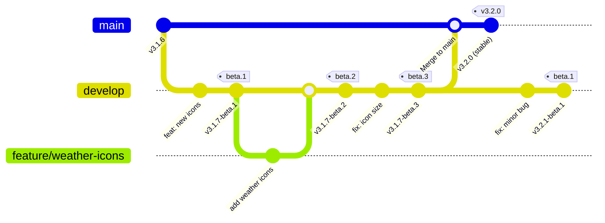
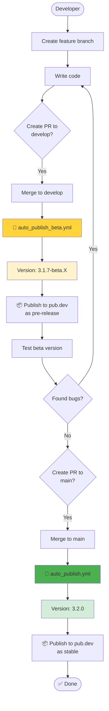
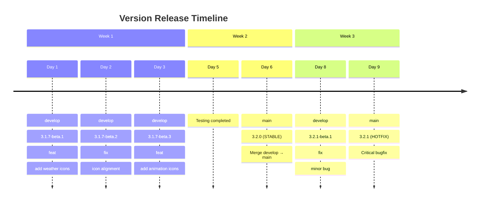
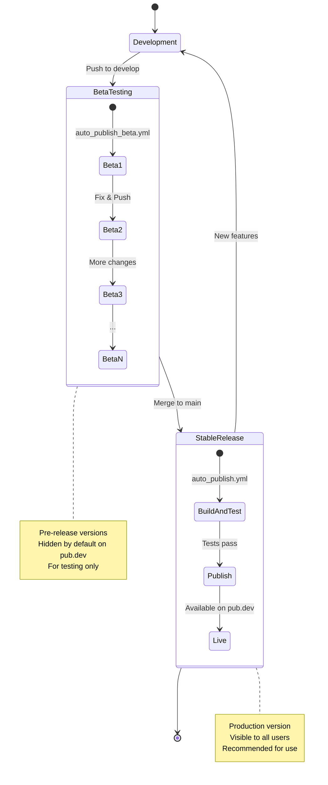
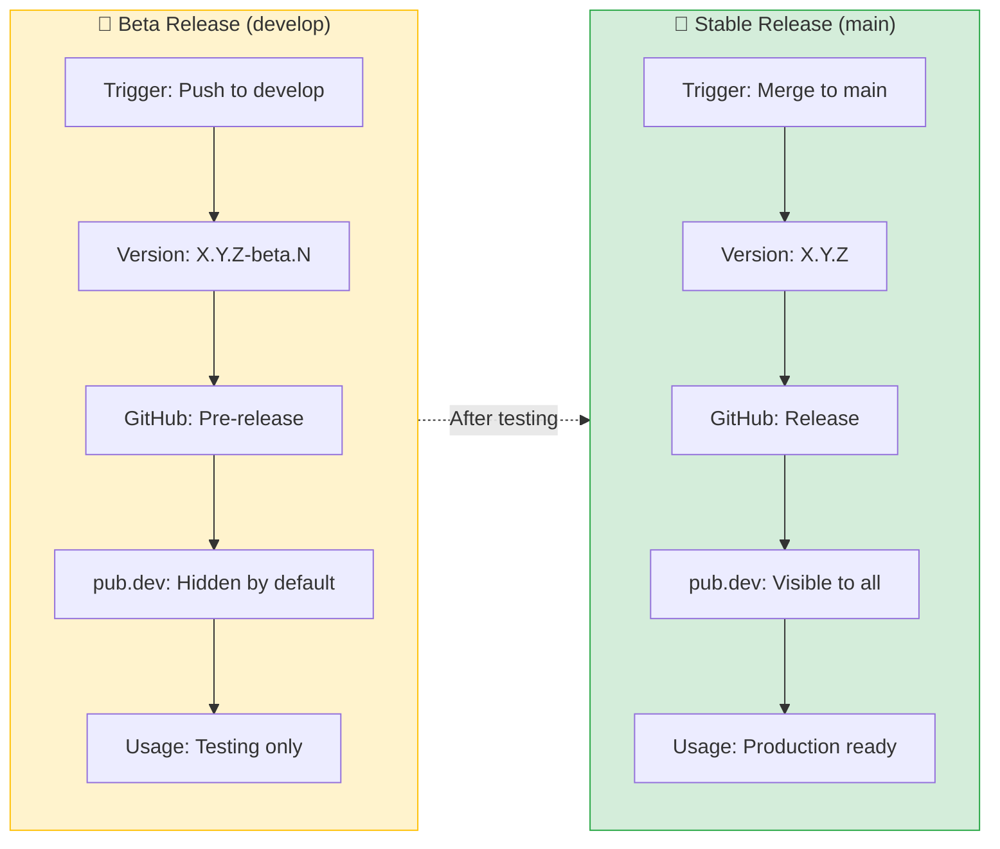
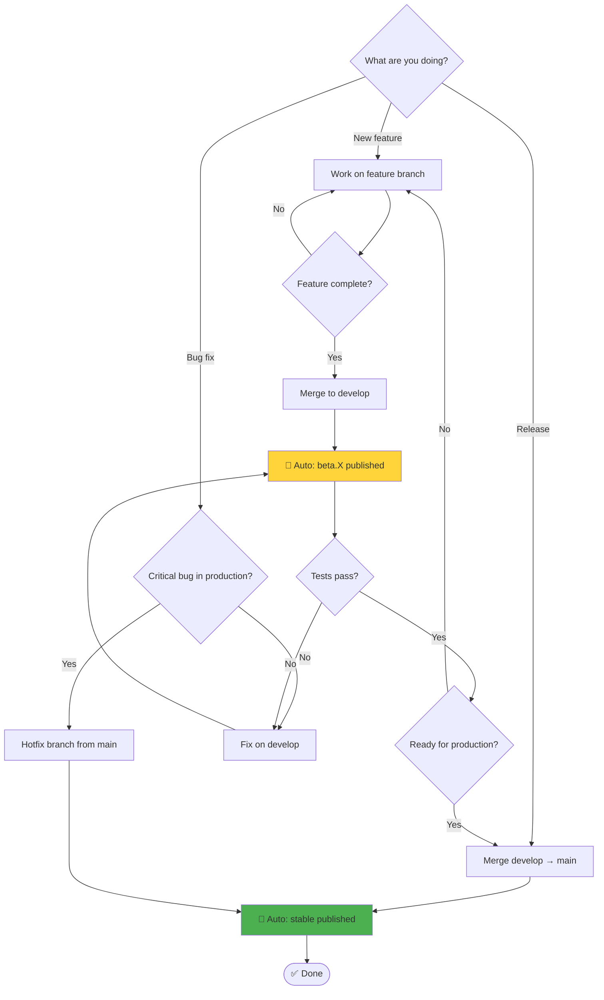

# Branching Strategy Visualization

## Git Flow với Auto-Publish

## Workflow Trigger Flow

## Version Progression Timeline

## State Diagram: Package Version States

## Comparison: Beta vs Stable

## Decision Tree: Which Branch to Use?

---

## 📝 Giải thích các trạng thái

### 🏗️ Development (Feature Branch)

- Làm việc trên các tính năng mới
- Không trigger workflow
- Tạo PR vào `develop` khi hoàn thành

### 🧪 Beta Testing (Develop Branch)

- Mỗi push → tạo version beta mới
- Version format: `X.Y.Z-beta.N`
- Tự động publish lên pub.dev (pre-release)
- Dùng để testing trước khi release chính thức

### 🚀 Stable Release (Main Branch)

- Merge từ develop sau khi testing thành công
- Version format: `X.Y.Z`
- Tự động publish lên pub.dev (stable)
- Production-ready

### 🔥 Hotfix

- Fix urgent bugs trên production
- Branch từ `main`, merge trực tiếp về `main`
- Trigger workflow stable release
- Nhớ merge lại vào `develop` sau đó

---

**Tip**: Lưu lại các diagrams này để hiểu rõ flow! 📊
