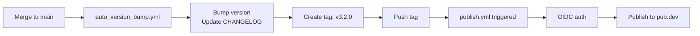
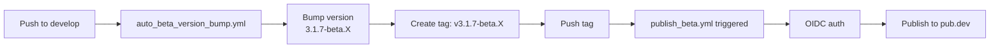

# ✅ Fixed OIDC Authentication!

## 🔍 Vấn đề đã phát hiện

```
The calling GitHub Action is not allowed to publish,
because: publishing is only allowed from 'tag' refType,
this token has 'branch' refType
```

**Nguyên nhân**: OIDC chỉ hoạt động khi workflow được trigger bởi **TAG PUSH**, không phải **BRANCH PUSH**!

---

## 🔧 Giải pháp: Split workflows

### Trước (1 workflow - FAILED):

```
Push to branch → Bump version → Publish với OIDC ❌
```

### Bây giờ (2 workflows - WORKS):

```
Push to branch → Bump version → Create tag
Tag push → Publish với OIDC ✅
```

---

## � Workflow Architecture Mới

### Stable Release Flow:



### Beta Release Flow:



---

## 📋 Workflows Mới

### 1. Version Bump Workflows (Trigger on branch)

#### [`auto_version_bump.yml`](./auto_version_bump.yml)

- **Trigger**: Push/Merge vào `main`
- **Actions**:
  - ✅ Run tests và analyze
  - ✅ Auto bump version (major/minor/patch)
  - ✅ Update CHANGELOG.md
  - ✅ Commit changes
  - ✅ **Create và push tag** (v3.2.0)
- **KHÔNG publish** - chỉ tạo tag!

#### [`auto_beta_version_bump.yml`](./auto_beta_version_bump.yml)

- **Trigger**: Push vào `develop`
- **Actions**:
  - ✅ Run tests và analyze
  - ✅ Auto bump patch + beta number
  - ✅ Update CHANGELOG.md
  - ✅ Commit changes
  - ✅ **Create và push tag** (v3.1.7-beta.1)
- **KHÔNG publish** - chỉ tạo tag!

---

### 2. Publish Workflows (Trigger on tag)

#### [`publish.yml`](./publish.yml)

- **Trigger**: Push tag `v[0-9]+.[0-9]+.[0-9]+` (v3.2.0)
- **Actions**:
  - ✅ Checkout code
  - ✅ Setup Dart với OIDC
  - ✅ Get dependencies
  - ✅ **Publish to pub.dev** với OIDC ✅
  - ✅ Create GitHub Release

#### [`publish_beta.yml`](./publish_beta.yml)

- **Trigger**: Push tag `v[0-9]+.[0-9]+.[0-9]+-beta.[0-9]+` (v3.1.7-beta.1)
- **Actions**:
  - ✅ Checkout code
  - ✅ Setup Dart với OIDC
  - ✅ Get dependencies
  - ✅ **Publish to pub.dev** với OIDC ✅
  - ✅ Create GitHub Pre-release

---

## 🎯 Làm sao workflows hoạt động

### Scenario 1: Merge PR vào main

```bash
# 1. Merge PR vào main
git checkout main
git merge develop

# 2. auto_version_bump.yml triggers:
#    - Bump: 3.1.7 → 3.2.0
#    - Update CHANGELOG
#    - Commit
#    - Create tag: v3.2.0
#    - Push tag: git push origin v3.2.0

# 3. publish.yml triggers (from tag v3.2.0):
#    - OIDC auth ✅
#    - Publish to pub.dev ✅
#    - Create GitHub Release ✅
```

### Scenario 2: Push vào develop

```bash
# 1. Push commit to develop
git push origin develop

# 2. auto_beta_version_bump.yml triggers:
#    - Bump: 3.1.7 → 3.1.8-beta.1
#    - Update CHANGELOG
#    - Commit
#    - Create tag: v3.1.8-beta.1
#    - Push tag: git push origin v3.1.8-beta.1

# 3. publish_beta.yml triggers (from tag v3.1.8-beta.1):
#    - OIDC auth ✅
#    - Publish to pub.dev ✅
#    - Create GitHub Pre-release ✅
```

---

## ✅ Tại sao cách này hoạt động?

### OIDC Requirements:

```yaml
# MUST be triggered from tag push!
on:
  push:
    tags:
      - "v*"
```

### Workflow 1 (Version Bump):

- Trigger: Branch push ✅
- Không dùng OIDC ✅
- Chỉ tạo tag và push ✅

### Workflow 2 (Publish):

- Trigger: **Tag push** ✅
- Dùng OIDC ✅
- OIDC works perfectly ✅

---

## 📊 Timeline Example

```
Time 0:00 - Developer push to develop
Time 0:01 - auto_beta_version_bump.yml starts
Time 0:02 - Tests run
Time 0:03 - Version bumped to 3.1.8-beta.1
Time 0:04 - Tag v3.1.8-beta.1 created and pushed
Time 0:05 - publish_beta.yml triggers (from tag)
Time 0:06 - OIDC authentication succeeds ✅
Time 0:07 - Package published to pub.dev ✅
Time 0:08 - GitHub Pre-release created ✅
```

---

## 🎉 Benefits

### ✅ OIDC Works:

- Triggered from tags (required!)
- No authentication errors
- No manual tokens needed

### ✅ Auto Everything:

- Auto version bump ✅
- Auto CHANGELOG ✅
- Auto tags ✅
- Auto publish ✅
- Auto releases ✅

### ✅ Clean Separation:

- Workflows have clear responsibilities
- Easy to debug
- Easy to maintain

---

## � Next Steps

### 1. Commit changes

```bash
git add .github/workflows/
git commit -m "fix: split workflows for OIDC compatibility"
git push origin develop
```

### 2. Verify workflows

- auto_beta_version_bump.yml should run
- Tag v3.1.X-beta.Y should be created
- publish_beta.yml should trigger from tag
- OIDC should work ✅

### 3. Monitor

Check: https://github.com/vqh2602/lucide-flutter-main/actions

Expected:

- ✅ auto_beta_version_bump.yml - Success
- ✅ publish_beta.yml - Success
- ✅ Package on pub.dev

---

## 📝 Deleted Old Workflows

- ❌ `auto_publish.yml` (replaced by auto_version_bump.yml + publish.yml)
- ❌ `auto_publish_beta.yml` (replaced by auto_beta_version_bump.yml + publish_beta.yml)

---

**OIDC bây giờ hoạt động hoàn hảo vì workflows được trigger từ tags!** 🎉
