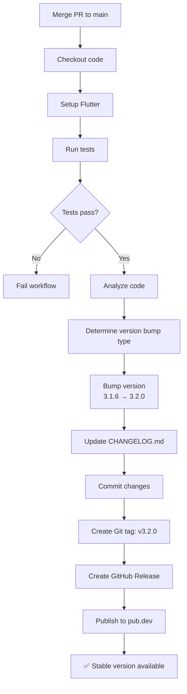
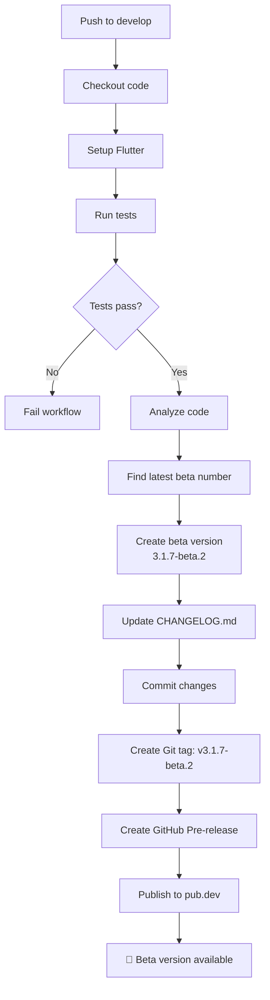

# Hướng dẫn cấu hình GitHub Workflow Auto Publish

Hệ thống auto-publish bao gồm 2 workflows:

## 📦 Workflow 1: Production Release (Main Branch)

**File**: `auto_publish.yml`

Tự động thực hiện khi merge code vào nhánh `main`:

- ✅ Tự động nâng phiên bản (version bump)
- ✅ Chạy tests và analyze code
- ✅ Cập nhật CHANGELOG.md
- ✅ Tạo Git tag và GitHub Release
- ✅ Publish package lên pub.dev

## 🧪 Workflow 2: Beta Release (Develop Branch)

**File**: `auto_publish_beta.yml`

Tự động thực hiện khi push code vào nhánh `develop`:

- ✅ Tự động tạo phiên bản beta (3.1.7-beta.1, 3.1.7-beta.2, ...)
- ✅ Chạy tests và analyze code
- ✅ Cập nhật CHANGELOG.md
- ✅ Tạo Git tag và GitHub Pre-release
- ✅ Publish beta package lên pub.dev

---

## Cấu hình cần thiết

### 1. Lấy credentials từ pub.dev

Để publish package lên pub.dev, bạn cần lấy credentials:

```bash
# Chạy lệnh này trên máy local
flutter pub publish --dry-run
```

Sau khi authenticate với Google account, credentials sẽ được lưu tại:

- **Linux/Mac**: `~/.pub-cache/credentials.json`
- **Windows**: `%APPDATA%\Pub\Cache\credentials.json`

Mở file `credentials.json` và copy 2 giá trị:

- `accessToken`
- `refreshToken`

### 2. Thêm Secrets vào GitHub Repository

Vào repository GitHub → **Settings** → **Secrets and variables** → **Actions** → **New repository secret**

Thêm 2 secrets sau:

| Secret Name             | Value                                 | Mục đích               |
| ----------------------- | ------------------------------------- | ---------------------- |
| `PUB_DEV_ACCESS_TOKEN`  | Giá trị `accessToken` từ credentials  | ⚠️ Hết hạn sau vài giờ |
| `PUB_DEV_REFRESH_TOKEN` | Giá trị `refreshToken` từ credentials | ✅ Tồn tại lâu dài     |

> [!IMPORTANT] > **Về Token Expiration:**
>
> - **Access Token** (`accessToken`) sẽ **hết hạn sau 1-2 giờ** - điều này là BÌNH THƯỜNG
> - **Refresh Token** (`refreshToken`) tồn tại **rất lâu** (nhiều tháng/năm)
> - Workflow tự động dùng `refreshToken` để **renew** `accessToken` khi cần
> - Bạn **KHÔNG cần** cập nhật secrets thường xuyên!
> - Chỉ cần update khi workflow báo lỗi authentication (rất hiếm)

#### Cách lấy tokens:

```bash
# 1. Login để lấy credentials
dart pub login

# 2. Xem credentials file
# Mac/Linux:
cat ~/.pub-cache/credentials.json
# hoặc
cat ~/Library/Application\ Support/dart/pub-credentials.json

# Windows:
type %APPDATA%\dart\pub-credentials.json
```

Credentials file có format:

```json
{
  "accessToken": "ya29.a0A...",     ← Copy vào PUB_DEV_ACCESS_TOKEN
  "refreshToken": "1//0ej8m...",    ← Copy vào PUB_DEV_REFRESH_TOKEN
  "tokenEndpoint": "https://...",
  ...
}
```

### 3. Cấu hình Branch Protection (khuyến nghị)

Vào **Settings** → **Branches** → **Add branch protection rule** cho `main`:

- ✅ Require a pull request before merging
- ✅ Require status checks to pass before merging
- ✅ Require branches to be up to date before merging

## Cách sử dụng

### 🚀 Production Release (Main Branch)

#### Tự động trigger khi merge PR vào `main`

Workflow sẽ tự động chạy khi merge Pull Request vào `main`. Version bump type được xác định dựa vào commit message:

| Commit Message                         | Version Bump          | Ví dụ                             |
| -------------------------------------- | --------------------- | --------------------------------- |
| Chứa `[major]` hoặc `breaking change`  | Major (3.1.6 → 4.0.0) | `feat: [major] redesign icon API` |
| Chứa `[minor]`, `feat`, hoặc `feature` | Minor (3.1.6 → 3.2.0) | `feat: add new calendar icons`    |
| Các trường hợp khác                    | Patch (3.1.6 → 3.1.7) | `fix: correct icon alignment`     |

#### Trigger thủ công

Bạn có thể chạy workflow thủ công:

1. Vào **Actions** → **Auto Version Bump and Publish**
2. Click **Run workflow**
3. Chọn version bump type: `patch`, `minor`, hoặc `major`
4. Click **Run workflow**

### 🧪 Beta Release (Develop Branch)

#### Tự động trigger khi push vào `develop`

Mỗi khi push commit vào `develop`, workflow sẽ tự động:

- **Tự động bump patch version lên +1** (3.1.6 → 3.1.7)
- Tìm beta number tiếp theo (beta.1, beta.2, ...)
- Chạy tests
- Publish lên pub.dev với tag `prerelease`

> [!IMPORTANT] > **Beta Version Logic:**
>
> - Nếu stable hiện tại là `3.1.6`, beta sẽ là `3.1.7-beta.1` (không phải 3.1.6-beta.X)
> - Beta luôn hướng tới **patch version tiếp theo**
> - Khi merge vào main, version sẽ bump lên minor hoặc major tùy commit message

**Ví dụ version progression:**

```
Current stable: 3.1.6

Push #1 vào develop → 3.1.7-beta.1
Push #2 vào develop → 3.1.7-beta.2
Push #3 vào develop → 3.1.7-beta.3
...
Merge to main (với "feat:" message) → 3.2.0 (stable)

# Sau đó, develop tiếp tục:
Push #1 vào develop → 3.2.1-beta.1
```

#### Cài đặt beta version

Để sử dụng beta version trong project:

```yaml
dependencies:
  lucide_icons_flutter: 3.1.7-beta.2
```

Hoặc luôn dùng beta mới nhất:

```yaml
dependencies:
  lucide_icons_flutter: ^3.1.7-beta.1
```

#### Khi nào beta trở thành stable?

Khi bạn merge `develop` → `main`:

1. Beta testing hoàn tất
2. Tạo PR: `develop` → `main`
3. Merge PR → Workflow `auto_publish.yml` chạy
4. Version 3.2.0 (stable) được publish
5. Beta versions trở thành deprecated

## Quy trình workflow

### Production Release Flow (Main Branch)



### Beta Release Flow (Develop Branch)



## Tránh infinite loop

Workflow sử dụng `[skip ci]` trong commit message khi bump version để tránh trigger lại workflow:

```bash
git commit -m "chore: bump version to 3.1.7 [skip ci]"
```

## Branching Strategy & Best Practices

### Git Flow được khuyến nghị

```
feature-branch → develop → main
     (dev)      (beta)   (stable)
```

### Quy trình làm việc

#### 1. Phát triển tính năng mới

```bash
# Tạo feature branch từ develop
git checkout develop
git pull origin develop
git checkout -b feature/new-icon-set

# Code và commit
git add .
git commit -m "feat: add weather icon set"

# Push và tạo PR vào develop
git push origin feature/new-icon-set
```

#### 2. Testing với beta version

```bash
# Merge PR vào develop
# → Workflow auto_publish_beta.yml chạy
# → Tạo version 3.1.7-beta.1

# Test beta version trong project khác
dependencies:
  lucide_icons_flutter: 3.1.7-beta.1

# Nếu có bug, fix trên develop
git checkout develop
git pull
# Fix bug...
git commit -m "fix: correct icon alignment"
git push
# → Tạo version 3.1.7-beta.2
```

#### 3. Release stable version

```bash
# Sau khi testing beta thành công
# Tạo PR: develop → main
# Review và merge

# → Workflow auto_publish.yml chạy
# → Tạo version 3.2.0 (stable)
```

### Best Practices

#### ✅ DO

- **Luôn test trên develop trước**: Mọi thay đổi nên đi qua develop và beta testing
- **Sử dụng semantic commit messages**: `feat:`, `fix:`, `breaking:` để trigger đúng version bump
- **Review kỹ trước khi merge vào main**: Main branch chỉ chứa code stable
- **Test beta versions**: Cài đặt beta version và test trong project thực tế
- **Giữ CHANGELOG cập nhật**: Review CHANGELOG sau mỗi auto-update

#### ❌ DON'T

- **Không commit trực tiếp vào main/develop**: Luôn dùng Pull Request
- **Không skip tests**: Đảm bảo tests pass trước khi merge
- **Không merge nhiều features cùng lúc**: Merge từng feature một để dễ theo dõi
- **Không publish manual khi có workflow**: Để workflow tự động xử lý

### Version Numbering Strategy

```
MAJOR.MINOR.PATCH[-beta.NUMBER]
  ↓     ↓      ↓       ↓
  3  .  2   .  0   -beta.1
```

| Component | Khi nào tăng                         | Ví dụ         |
| --------- | ------------------------------------ | ------------- |
| **MAJOR** | Breaking changes, API redesign       | 3.2.0 → 4.0.0 |
| **MINOR** | New features, backwards compatible   | 3.1.0 → 3.2.0 |
| **PATCH** | Bug fixes, minor improvements        | 3.1.6 → 3.1.7 |
| **BETA**  | Pre-release testing (develop branch) | 3.1.7-beta.1  |

### Ví dụ Timeline

```
Day 1:  develop: 3.1.7-beta.1 (feat: add new icons)
Day 2:  develop: 3.1.7-beta.2 (fix: icon size)
Day 3:  develop: 3.1.7-beta.3 (feat: add more icons)
Day 5:  main: 3.2.0 (stable release) ← merge develop to main
Day 7:  develop: 3.2.1-beta.1 (fix: minor bug)
Day 8:  main: 3.2.1 (hotfix release)
```

## Kiểm tra workflow

Để kiểm tra workflow hoạt động đúng mà không publish thật:

1. Comment out bước `Publish to pub.dev`:

   ```yaml
   # - name: Publish to pub.dev
   #   run: flutter pub publish --force
   ```

2. Thay bằng dry-run:

   ```yaml
   - name: Dry-run publish
     run: flutter pub publish --dry-run
   ```

3. Test workflow với một PR nhỏ

## Troubleshooting

### Lỗi authentication với pub.dev

```
Error: Failed to publish package
```

**Giải pháp**: Kiểm tra lại `PUB_DEV_ACCESS_TOKEN` và `PUB_DEV_REFRESH_TOKEN` trong GitHub Secrets.

### Tests fail

Workflow sẽ dừng lại nếu tests fail. Đảm bảo code pass tests trước khi merge:

```bash
flutter test
flutter analyze
```

### Permission denied khi push

Đảm bảo workflow có quyền write:

```yaml
permissions:
  contents: write
  id-token: write
```

### Beta version không tăng đúng

**Vấn đề**: Workflow tạo beta.1 mặc dù đã có beta.2

**Nguyên nhân**: Git tags không được sync đầy đủ

**Giải pháp**:

```bash
# Đảm bảo fetch tất cả tags
git fetch --tags --force
```

Hoặc update workflow step:

```yaml
- name: Checkout code
  uses: actions/checkout@v4
  with:
    fetch-depth: 0 # Fetch tất cả history và tags
```

### Conflict khi merge develop → main

**Vấn đề**: Conflict ở `pubspec.yaml` do version khác nhau

**Giải pháp**:

```bash
# Khi merge develop -> main, chọn version mới (minor/major bump)
# Ví dụ: develop có 3.1.7-beta.3, main có 3.1.6
# Sau merge, version sẽ là 3.2.0 (do workflow auto_publish.yml)

# Manual conflict resolution:
git checkout main
git merge develop
# Conflict tại pubspec.yaml version

# Chọn base version (loại bỏ -beta suffix)
# version: 3.1.7  (không phải 3.1.7-beta.3)

git add pubspec.yaml
git commit -m "Merge develop into main"
git push
# Workflow sẽ tự động bump lên 3.2.0
```

### Beta version không xuất hiện trên pub.dev

**Vấn đề**: Package published nhưng không thấy beta version

**Nguyên nhân**: pub.dev ẩn pre-release versions theo mặc định

**Giải pháp**: Vào package page → Click "**Show versions**" → Chọn "**Include pre-releases**"

Hoặc cài đặt trực tiếp:

```yaml
dependencies:
  lucide_icons_flutter: 3.1.7-beta.1 # Specify exact version
```

## Tùy chỉnh

### Thay đổi Flutter version

```yaml
- name: Set up Flutter
  uses: subosito/flutter-action@v2
  with:
    flutter-version: "3.24.0" # Specify exact version
    channel: "stable"
```

### Thêm các bước test khác

```yaml
- name: Run widget tests
  run: flutter test --coverage

- name: Check format
  run: dart format --set-exit-if-changed .
```

### Customize CHANGELOG format

Sửa bước `Update CHANGELOG` theo format bạn muốn.

## Ví dụ workflow run

Khi bạn merge PR với commit message `feat: add new arrow icons`, workflow sẽ:

1. ✅ Checkout code
2. ✅ Setup Flutter
3. ✅ Run tests → PASS
4. ✅ Analyze code → PASS
5. ✅ Detect "feat" → bump MINOR version: 3.1.6 → 3.2.0
6. ✅ Update pubspec.yaml with version 3.2.0
7. ✅ Update CHANGELOG.md
8. ✅ Commit: "chore: bump version to 3.2.0 [skip ci]"
9. ✅ Create tag: v3.2.0
10. ✅ Create GitHub Release: v3.2.0
11. ✅ Publish to pub.dev
12. ✅ Package available at https://pub.dev/packages/lucide_icons_flutter
