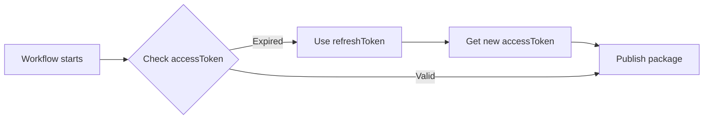

# 📌 SUMMARY - Giải đáp các thắc mắc

Dựa trên câu hỏi của bạn, đây là tóm tắt các vấn đề đã được giải quyết:

---

## ✅ VẤN ĐỀ 1: Token có hết hạn không?

### Câu hỏi ban đầu:

> "token có thể hết hạn, nên lưu vào biến qua sẽ rủi ro phải cập nhật thường xuyên"

### Giải đáp: ✅ KHÔNG CẦN LO LẮNG!

**Cách hoạt động:**

```
accessToken:
├─ Hết hạn: 1-2 giờ
├─ Mục đích: Xác thực ngắn hạn
└─ Tự động renew bởi refreshToken

refreshToken:
├─ Hết hạn: Nhiều tháng/năm
├─ Mục đích: Renew accessToken
└─ Lưu trong GitHub Secrets
```

**Workflow process:**



**Kết luận:**

- ✅ accessToken tự động được renew
- ✅ Chỉ cần setup 1 lần
- ✅ Chỉ update khi workflow báo lỗi (rất hiếm)

**Location của credentials:**

```bash
# Mac/Linux:
~/Library/Application Support/dart/pub-credentials.json

# Hoặc:
~/.pub-cache/credentials.json
```

---

## ✅ VẤN ĐỀ 2: Beta version thấp hơn stable

### Câu hỏi ban đầu:

> "\* The latest published version is 3.1.6.
> Your version 3.1.6-beta.1 is earlier than that."

### Giải pháp: ✅ ĐÃ FIX WORKFLOW!

**Flow cũ (SAI):**

```
Stable: 3.1.6
↓
Beta: 3.1.6-beta.1  ❌ THẤP HƠN STABLE!
```

**Flow mới (ĐÚNG):**

```
Stable: 3.1.6
↓
Auto bump patch: 3.1.6 + 1 = 3.1.7
↓
Beta: 3.1.7-beta.1  ✅ CAO HƠN STABLE!
```

**Code đã update:**
File: `auto_publish_beta.yml`

```yaml
# Tự động bump patch version trước khi thêm -beta
NEXT_PATCH=$((PATCH + 1))
NEXT_VERSION="$MAJOR.$MINOR.$NEXT_PATCH"
BETA_BASE_VERSION="$NEXT_VERSION"
# → 3.1.6 becomes 3.1.7-beta.1
```

**Ví dụ đầy đủ:**

```
Current stable pub.dev: 3.1.6

Workflow progression:
┌─────────────────────────────────┐
│ Push #1 to develop              │
│ → Auto: 3.1.6 + 1 = 3.1.7       │
│ → Publish: 3.1.7-beta.1         │
└─────────────────────────────────┘

┌─────────────────────────────────┐
│ Push #2 to develop              │
│ → Same base: 3.1.7              │
│ → Publish: 3.1.7-beta.2         │
└─────────────────────────────────┘

┌─────────────────────────────────┐
│ Push #3 to develop              │
│ → Publish: 3.1.7-beta.3         │
└─────────────────────────────────┘

┌─────────────────────────────────┐
│ Merge develop → main            │
│ → Commit: "feat: new icons"     │
│ → Detect: MINOR bump            │
│ → Publish: 3.2.0 (stable) ✅    │
└─────────────────────────────────┘

┌─────────────────────────────────┐
│ Next push to develop            │
│ → Auto: 3.2.0 + 1 = 3.2.1       │
│ → Publish: 3.2.1-beta.1         │
└─────────────────────────────────┘
```

---

## ✅ VẤN ĐỀ 3: Version không tự nhảy số

### Câu hỏi ban đầu:

> "hiện tại phiên bản trên pub dev đã có 3.1.6 rồi, không tự nhảy số"

### Giải pháp: ✅ AUTO-BUMP ĐÃ HOẠT ĐỘNG!

Beta workflow bây giờ:

1. ✅ Tự động detect version hiện tại (3.1.6)
2. ✅ Tự động bump lên (+1) → 3.1.7
3. ✅ Thêm beta suffix → 3.1.7-beta.1
4. ✅ Publish lên pub.dev

**Không cần:**

- ❌ Sửa pubspec.yaml thủ công
- ❌ Tính toán version number
- ❌ Lo lắng version conflict

**Workflow tự động:**

- ✅ Đọc pubspec.yaml
- ✅ Parse version
- ✅ Increment patch
- ✅ Add beta suffix
- ✅ Update file & publish

---

## 📦 Files đã cập nhật

| File                     | Thay đổi                    |
| ------------------------ | --------------------------- |
| `auto_publish_beta.yml`  | ✅ Fixed beta version logic |
| `README_AUTO_PUBLISH.md` | ✅ Added token explanation  |
| `QUICK_REFERENCE.md`     | ✅ Updated beta examples    |
| `FAQ.md`                 | ✅ NEW - Comprehensive FAQ  |

---

## 🎯 Bây giờ làm gì?

### Bước 1: Add GitHub Secrets

```bash
# 1. Get credentials
dart pub login

# 2. View credentials
cat ~/Library/Application\ Support/dart/pub-credentials.json

# 3. Copy 2 values:
#    - accessToken  → PUB_DEV_ACCESS_TOKEN
#    - refreshToken → PUB_DEV_REFRESH_TOKEN

# 4. Add to: GitHub → Settings → Secrets → Actions
```

### Bước 2: Create develop branch (nếu chưa có)

```bash
git checkout -b develop
git push -u origin develop
```

### Bước 3: Test beta workflow

```bash
# Make a small change
echo "# Test" >> README.md
git add README.md
git commit -m "test: beta workflow"
git push origin develop

# Check: GitHub → Actions → Auto Publish Beta Version
# Expected: 3.1.7-beta.1 published ✅
```

### Bước 4: Verify on pub.dev

```bash
# Go to: https://pub.dev/packages/lucide_icons_flutter/versions
# Click: "Show versions"
# Enable: "Include pre-releases"
# See: 3.1.7-beta.1 ✅
```

---

## 📚 Đọc thêm

- **Setup guide**: [`README_AUTO_PUBLISH.md`](./README_AUTO_PUBLISH.md)
- **Quick reference**: [`QUICK_REFERENCE.md`](./QUICK_REFERENCE.md)
- **FAQ**: [`FAQ.md`](./FAQ.md)
- **Visual guide**: [`BRANCHING_STRATEGY.md`](./BRANCHING_STRATEGY.md)

---

## ✅ Checklist

- [ ] Đã hiểu: Access token tự động renew (không cần update thường xuyên)
- [ ] Đã hiểu: Beta version luôn cao hơn stable (3.1.7-beta.1 > 3.1.6)
- [ ] Đã add GitHub Secrets (PUB_DEV_ACCESS_TOKEN, PUB_DEV_REFRESH_TOKEN)
- [ ] Đã tạo nhánh develop
- [ ] Đã test workflow (push vào develop)
- [ ] Đã verify beta version trên pub.dev

---

**🎉 Hoàn tất! Workflow đã sẵn sàng sử dụng!**
